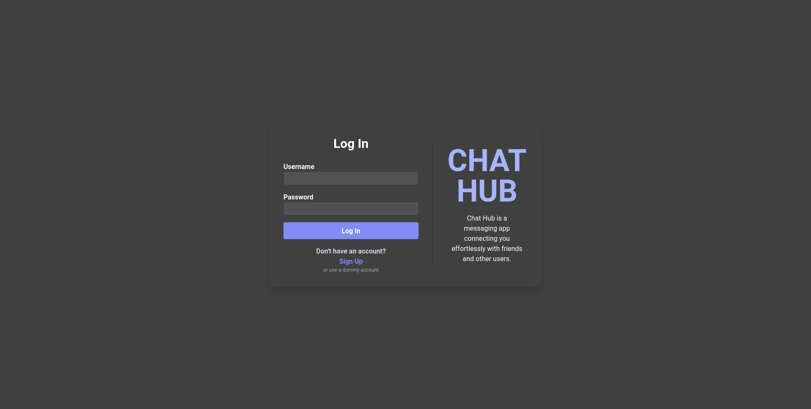
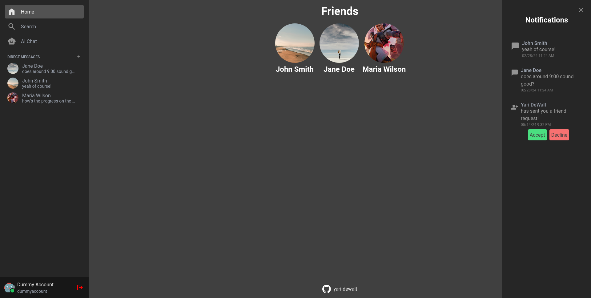
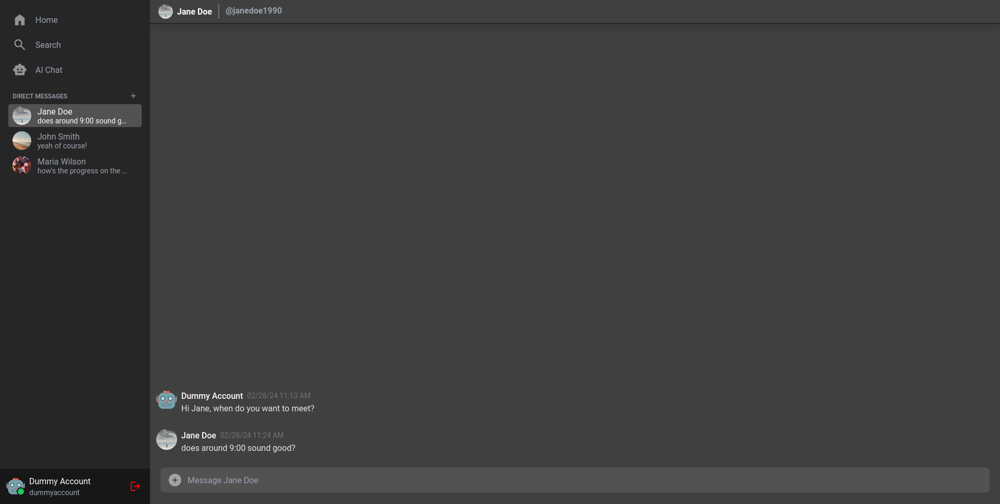

<h1 align="center"><a href="https://yari-dewalt-chathub.netlify.app">ChatHub</a></h1>
<h2>About</h2>

ChatHub is a messaging platform project based off of Discord. Supported by a REST API backend (Note: The backend is hosted by a free service meaning initial load times can be long if it has been sleeping), one can utilize all of the features of a typical messaging app. Add friends, customize your profile, and message other users.

<h2>Features</h2>
<ul>
    <li><b>Real-time messaging:</b> Chat with friends and other users instantly and in real-time.</li>
    <li><b>Profile Customization:</b> Upload a profile picture and change your about me section!</li>
    <li><b>Search Functionality:</b> Easily find users to add as friends or message through the search feature.</li>
    <li><b>Notification system:</b> Stay informed with the instantaneous notification system.</li>
    <li><b>AI Chat:</b> Converse with an OpenAI backed chat bot!</li>
</ul>
<h3>Made with</h3>
<ul>
    <li>React (TypeScript)</li>
    <li>Tailwind CSS</li>
    <li>Express</li>
    <li>MongoDB</li>
</ul>
<h2>Screenshots</h2>
</img>
</img>
</img>
